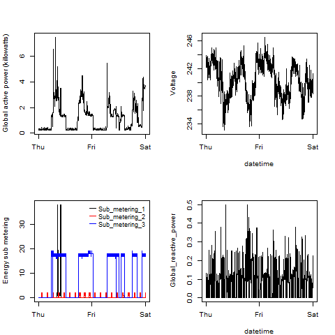

## Introduction

This assignment uses data from
the <a href="http://archive.ics.uci.edu/ml/">UC Irvine Machine
Learning Repository</a>, a popular repository for machine learning
datasets. In particular, we will be using the "Individual household
electric power consumption Data Set" which I have made available on
the course web site:

* <b>Dataset</b>: <a href="https://d396qusza40orc.cloudfront.net/exdata%2Fdata%2Fhousehold_power_consumption.zip">Electric power consumption</a> [20Mb]

* <b>Description</b>: Measurements of electric power consumption in
one household with a one-minute sampling rate over a period of almost
4 years. Different electrical quantities and some sub-metering values
are available.

The following descriptions of the 9 variables in the dataset are taken
from
the <a href="https://archive.ics.uci.edu/ml/datasets/Individual+household+electric+power+consumption">UCI
web site</a>:

<ol>
<li><b>Date</b>: Date in format dd/mm/yyyy </li>
<li><b>Time</b>: time in format hh:mm:ss </li>
<li><b>Global_active_power</b>: household global minute-averaged active power (in kilowatt) </li>
<li><b>Global_reactive_power</b>: household global minute-averaged reactive power (in kilowatt) </li>
<li><b>Voltage</b>: minute-averaged voltage (in volt) </li>
<li><b>Global_intensity</b>: household global minute-averaged current intensity (in ampere) </li>
<li><b>Sub_metering_1</b>: energy sub-metering No. 1 (in watt-hour of active energy). It corresponds to the kitchen, containing mainly a dishwasher, an oven and a microwave (hot plates are not electric but gas powered). </li>
<li><b>Sub_metering_2</b>: energy sub-metering No. 2 (in watt-hour of active energy). It corresponds to the laundry room, containing a washing-machine, a tumble-drier, a refrigerator and a light. </li>
<li><b>Sub_metering_3</b>: energy sub-metering No. 3 (in watt-hour of active energy). It corresponds to an electric water-heater and an air-conditioner.</li>
</ol>

## Loading the data

File|Description|Usage
----|-----------|-----
`hpc.R`|Shared R file to load household power consumption data in (2,075,259 rows and 9 columns). Required by all plot files - this ensures file is only loaded once|plot files import with `source('./hpc.R')`
`plot1.R`|Code to write plot1.png|Load with `source('./plot1.R')` followed by `plot1()`
`plot2.R`|Code to write plot2.png; required by plot4.R|Load with `source('./plot2.R')` followed by `plot2()`
`plot3.R`|Code to write plot3.png; required by plot4.R|Load with `source('./plot3.R')` followed by `plot3()`
`plot4.R`|Code to write plot4.png; using plot2.R and plot3.R|Load with `source('./plot4.R')` followed by `plot4()`
`plot1.png`|Plot output from plot1()||
`plot2.png`|Plot output from plot2()||
`plot3.png`|Plot output from plot3()||
`plot4.png`|Plot output from plot4()||

## Results

The four plots constructed are shown below against the expected result

**Note that expected result images are 504x504px rather than 480x480px so do not line vertically exactly**

### Plot 1

Output|Expected
------|--------
| 

### Plot 2

Output|Expected
------|--------
| 

### Plot 3

Output|Expected
------|--------
| 

### Plot 4

Output|Expected
------|--------
| 

